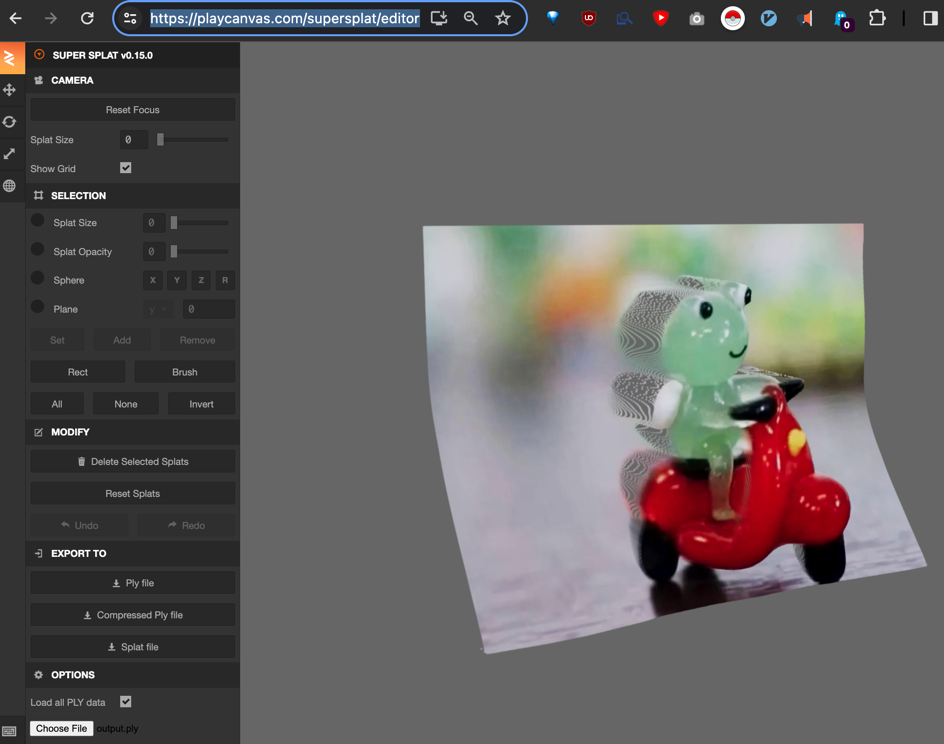

# Splatinit

Splatinit is a C program that converts an image (and optionally a depth map) into a 3D Gaussian Splat representation. The output is a .ply file compatible with the format produced in the "3D Gaussian Splatting for Real-Time Radiance Field Rendering" project. The program creates a single unoptimized 3D Gaussian Splat per pixel without any optimizations or Spherical Harmonics. Nor does it add view-dependent colors.

## Features

- Converts an image (and optionally a depth map) into a 3D Gaussian Splat representation
- Outputs a .ply file compatible with the "3D Gaussian Splatting for Real-Time Radiance Field Rendering" project
- Supports coalescing of adjacent splats with the same color (when no depth map is provided)
- Provides command-line options for specifying the output file path

## Usage

```
Usage: splatinit [options] <image_path> [depth_map_path]

Description: splatinit.c loops over an image and creates a single unoptimized 3D Gaussian Splat per pixel. The output is a .ply file that is in a compatible format produced in the '3D Gaussian Splatting for Real-Time Radiance Field Rendering' project. There are no optimizations or Spherical Harmonics that provide any view-dependent colors.

Options:
  -h, --help       Show this help message and exit
  -o, --output     Specify the output file path
```

## Dependencies

- stb_image.h: A single-file public domain library for loading images
- CMake: A cross-platform build system

## Building

1. Make sure you have CMake installed
2. Clone the repository or download the source code
3. Create a build directory and navigate to it:
   ```
   mkdir build
   cd build
   ```
4. Generate the build files using CMake:
   ```
   cmake ..
   ```
5. Build the project:
   ```
   cmake --build .
   ```

The executable `splatinit` will be generated in the `build` directory.

## Example

To convert an image `example.png` and its corresponding depth map `example_depth.png` into a 3D Gaussian Splat representation, run the following command:

```
./splatinit example.png example_depth.png
```

The output .ply file will be saved in the `/tmp/splatting/` directory with the name `output.ply`.

output.ply can be imported into a 3D Gaussian Splat viewer of choice. I enjoy using https://playcanvas.com/supersplat/editor

## License

This project is open-source and available under the MIT license

## Contributing

Contributions are welcome! If you find any issues or have suggestions for improvements, please open an issue or submit a pull request.

## Acknowledgements

- The program is inspired by the "3D Gaussian Splatting for Real-Time Radiance Field Rendering" project.
- The [stb_image.h](https://github.com/nothings/stb/blob/master/stb_image.h) library is used for loading image files.